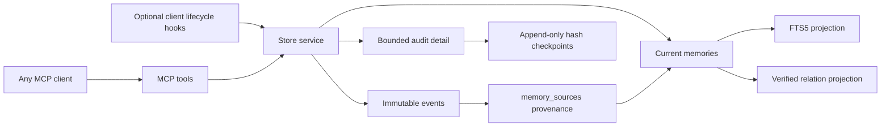

# Architecture

## Why Python and SQLite

Python 3.9+ is available on common developer machines and its standard library contains the HTTP, JSON, hashing, filesystem, and SQLite pieces this service needs. The runtime has no third-party dependencies. SQLite supplies atomic transactions, WAL concurrency, foreign keys, and FTS5 in one local file; this is a better MVP trade-off than adding a database daemon or embedding service.

The MCP adapter deliberately stays thin: newline-delimited JSON-RPC over stdio and Streamable HTTP-compatible JSON responses at `/mcp`. The business layer has no MCP dependency and can be exercised directly by tests or another client.

## Layers and invariants

- `events` preserve raw observations and provenance. Update/delete triggers make them append-only.
- `memories` are the current, explicitly statused interpretation. Their mutation history is retained in `audit_log`; sources are never replaced by a generated summary.
- `memory_sources` is the many-to-many evidence bridge. `edges` represents supersession, disputes, support, and dependencies.
- `memories_fts` is a rebuildable search projection. Database triggers keep it synchronized even when memory rows are changed outside the service layer; `search_health` verifies one projection row per authoritative memory.
- Every write opens `BEGIN IMMEDIATE`, updates all relevant layers, appends audit, stores an idempotent response when requested, and only then returns after `COMMIT`.

Each immutable event also receives a project-local monotonic `event_seq`, allocated in the same write transaction. `read_events_since` uses this as a stable cursor and captures a high-water mark before reading, so concurrent later commits are returned on the next poll. `message` is an event convention for unverified inter-session coordination, not a memory type; it never enters FTS or active-memory ranking unless separately promoted from evidence.

## Retrieval

Detailed audit entries are append-only during normal operation. Explicit maintenance can replace the oldest detail beyond a per-project retention limit with an append-only SHA-256 checkpoint chained to the previous checkpoint. This bounds the operational table and detects alteration, but intentionally does not preserve reconstructable old snapshots. Export before maintenance when full historical replay is required.

FTS5 BM25 supplies lexical relevance. An optional dependency-free on-device feature-hash projection improves fuzzy, morphological, and partial-phrase recall without claiming neural semantic understanding. Lexical and local-similarity ranks are combined with reciprocal-rank fusion, then receive small bounded adjustments for importance, confidence, confirmation freshness, and explicit helpful/incorrect feedback. Search results expose each weighted score component, the component ranks, and similarity so ranking remains inspectable. Expired validity windows are filtered at query time. `get_context` excludes proposed and superseded entries by default, includes disputed entries as warnings, respects optional scope, and greedily selects complete blocks within a strict character budget. Each block cites source event IDs.

Enable the local projection with `CONTEXT_MEMORY_EMBEDDINGS=local-hash`. It stores only a rebuildable vector projection in `memory_embeddings`; events and memories remain authoritative. `memory_feedback` records retrieved, used, helpful, and incorrect signals in a disposable usage projection. Memories separately retain `observed_at` and `last_confirmed_at` so personal ranking can decay stale assumptions without rewriting evidence.

Helpful, used, and incorrect feedback also makes small bounded changes to stored importance; every feedback write and resulting value is audited. `global` visibility makes a non-path-scoped memory searchable from every project in the same single-user database, while the default `project` visibility remains isolated during the primary search. If the primary search finds no current-project memory, `get_context` performs a bounded registry-wide discovery pass and reports the contributing project IDs. Global memories participate in both passes.

The current working directory is an identity hint, not the sole retrieval boundary. `project_resolve` checks an exact canonical path first, then a registered project-name alias only when that name is unambiguous. Newly observed checkout paths are registered. Discovery candidate generation searches the whole database with the same FTS/local-similarity ranking, then aggregates normalized relevance, bounded shared path/name priors, recent session/event activity, and the latest active checkpoint by project. A high-confidence candidate is selected only when it is sufficiently strong and separated from the runner-up; low-confidence and ambiguous results return candidates without mixing project-owned memories.

The requested context budget is not authoritative. Each project defaults to a hard 12,000-character and 20-item limit, configurable only within the server's 20,000-character/50-item safety ceiling. Responses report requested and effective budgets so clients can detect clamping. When cursor polling is requested, recent events are returned separately and consume the same effective character budget, with a 4,000-character event ceiling; unused event allowance remains available to ranked memories.

Project-owned search aliases expand known domain vocabulary before FTS matching. Aliases are explicit data, not inferred facts. `graph_traverse` walks verified memory edges with a depth limit of five and filters out non-current nodes by default. Both aliases and edges are exportable projections; neither replaces source events.

`EmbeddingProvider` remains a small optional interface, so a stronger local neural model can replace feature hashing later. Nothing downloads a model, sends content externally, or requires an API key in the default implementation.

## Lifecycle

Memories normally move `proposed → active`. They can later become `superseded`, `disputed`, `expired`, or `rejected`. A superseding or disputing memory points to the affected memory through an edge. Terminal memories remain query-excluded immediately and default to 180 days of operational retention. Explicit maintenance may remove older terminal rows, provenance links, and graph projections after first writing their source event IDs into audit detail. Immutable source events are never deleted.

At session end, events with explicit durable kinds (`fact`, `decision`, `preference`, `constraint`, `procedure`, `task`, or `summary`) can be converted deterministically into evidence-linked `proposed` memories. Similar active memories are attached as review conflicts. Nothing is autonomously promoted: review actions approve, reject, supersede, or dispute candidates.

Automatic handoff persistence separates portable storage semantics from completion detection. The client-neutral final checkpoint operation atomically writes the checkpoint, derives or replaces a sourced handoff, and closes the memory session through the same store service from MCP or CLI. Objective repository state can also be captured without a client SDK, and an explicitly supplied existing commit is verified and recorded without mutating Git. MCP 2026-07-28 removes protocol sessions in favor of stateless requests. Its optional Tasks extension can report `completed`, `failed`, or `cancelled` for one MCP request and can publish status through `subscriptions/listen`; it does not identify completion of the host agent's conversation or overall work item. It can therefore make an explicitly invoked checkpoint durable and observable, but cannot trigger that checkpoint from semantic agent completion. Consequently, hooks are optional completion-signal adapters only; the core checkpoint contract cannot depend on them, and unattended fallbacks must label snapshots as checkpoints rather than verified completion.

## Maintenance and backup

Project policy controls context limits, retained audit detail, and terminal-memory age. `maintain` is dry-run by default; `--apply` performs terminal cleanup and audit checkpointing in one write transaction. Maintenance never deletes raw events.

Copying only `memory.db` while WAL writes are active can miss committed pages still represented by WAL state. `backup` uses SQLite's Online Backup API and runs `integrity_check`, producing one mode-0600 snapshot plus a SHA-256 digest. This snapshot is the synchronization/backup artifact; the live database, `-wal`, and `-shm` files should not be copied independently.

Audit checkpoint exports can be anchored outside the database with a detached Ed25519 signature over a canonical project ID, head digest, and timestamp. The anchor contains only the public key and signature; signing keys enter through a caller-selected environment variable. Trust still depends on distributing or pinning the public key independently of the audit bundle and anchor.

Encrypted backups wrap that verified snapshot in a versioned AES-256-GCM envelope using a scrypt-derived key. The optional crypto dependency is loaded only for encryption/decryption, so the default local database and plain snapshot path remain dependency-free. Scheduled maintenance is a persisted due-check around the same explicit maintenance transaction; an external scheduler invokes it, and no resident worker is required.

## Threat model

The database directory is created mode `0700`. HTTP defaults to `127.0.0.1`; non-loopback binding is refused without a bearer token. Stdio is preferred because it creates no listening socket. These controls do not encrypt the database, redact secrets, isolate other processes running as the same OS user, or make bearer-token HTTP suitable for an untrusted network. Store only necessary project context and use OS disk encryption/backups.
