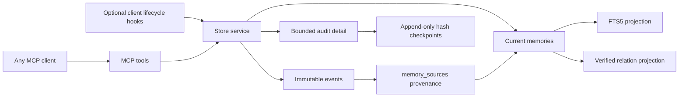

# Architecture

## Why Python and SQLite

Python 3.9+ is available on common developer machines and its standard library contains the HTTP, JSON, hashing, filesystem, and SQLite pieces this service needs. The runtime has no third-party dependencies. SQLite supplies atomic transactions, WAL concurrency, foreign keys, and FTS5 in one local file; this is a better MVP trade-off than adding a database daemon or embedding service.

The MCP adapter deliberately stays thin: newline-delimited JSON-RPC over stdio and Streamable HTTP-compatible JSON responses at `/mcp`. The business layer has no MCP dependency and can be exercised directly by tests or another client.

## Layers and invariants

- `events` preserve raw observations and provenance. Update/delete triggers make them append-only.
- `memories` are the current, explicitly statused interpretation. Their mutation history is retained in `audit_log`; sources are never replaced by a generated summary.
- `memory_sources` is the many-to-many evidence bridge. `edges` represents supersession, disputes, support, and dependencies.
- `memories_fts` is a rebuildable search projection. Database triggers keep it synchronized even when memory rows are changed outside the service layer; `search_health` verifies one projection row per authoritative memory.
- Every write opens `BEGIN IMMEDIATE`, updates all relevant layers, appends audit, stores an idempotent response when requested, and only then returns after `COMMIT`.

Each immutable event also receives a project-local monotonic `event_seq`, allocated in the same write transaction. `read_events_since` uses this as a stable cursor and captures a high-water mark before reading, so concurrent later commits are returned on the next poll. `message` is an event convention for unverified inter-session coordination, not a memory type; it never enters FTS or active-memory ranking unless separately promoted from evidence.

## Retrieval

Detailed audit entries are append-only during normal operation. Explicit maintenance can replace the oldest detail beyond a per-project retention limit with an append-only SHA-256 checkpoint chained to the previous checkpoint. This bounds the operational table and detects alteration, but intentionally does not preserve reconstructable old snapshots. Export before maintenance when full historical replay is required.

FTS5 BM25 supplies lexical relevance. Ranking then favors importance and confidence. Expired validity windows are filtered at query time. `get_context` excludes proposed and superseded entries by default, includes disputed entries as warnings, respects optional scope, and greedily selects complete blocks within a strict character budget. Each block cites source event IDs.

The requested context budget is not authoritative. Each project defaults to a hard 12,000-character and 20-item limit, configurable only within the server's 20,000-character/50-item safety ceiling. Responses report requested and effective budgets so clients can detect clamping. When cursor polling is requested, recent events are returned separately and consume the same effective character budget, with a 4,000-character event ceiling; unused event allowance remains available to ranked memories.

Project-owned search aliases expand known domain vocabulary before FTS matching. Aliases are explicit data, not inferred facts. `graph_traverse` walks verified memory edges with a depth limit of five and filters out non-current nodes by default. Both aliases and edges are exportable projections; neither replaces source events.

`EmbeddingProvider` is a small optional interface. A later local model or explicitly configured remote provider can implement it and add a vector score. Nothing downloads a model, sends content externally, or requires an API key in this MVP.

## Lifecycle

Memories normally move `proposed → active`. They can later become `superseded`, `disputed`, `expired`, or `rejected`. A superseding or disputing memory points to the affected memory through an edge. Terminal memories remain query-excluded immediately and default to 180 days of operational retention. Explicit maintenance may remove older terminal rows, provenance links, and graph projections after first writing their source event IDs into audit detail. Immutable source events are never deleted.

## Maintenance and backup

Project policy controls context limits, retained audit detail, and terminal-memory age. `maintain` is dry-run by default; `--apply` performs terminal cleanup and audit checkpointing in one write transaction. Maintenance never deletes raw events.

Copying only `memory.db` while WAL writes are active can miss committed pages still represented by WAL state. `backup` uses SQLite's Online Backup API and runs `integrity_check`, producing one mode-0600 snapshot plus a SHA-256 digest. This snapshot is the synchronization/backup artifact; the live database, `-wal`, and `-shm` files should not be copied independently.

## Threat model

The database directory is created mode `0700`. HTTP defaults to `127.0.0.1`; non-loopback binding is refused without a bearer token. Stdio is preferred because it creates no listening socket. These controls do not encrypt the database, redact secrets, isolate other processes running as the same OS user, or make bearer-token HTTP suitable for an untrusted network. Store only necessary project context and use OS disk encryption/backups.
