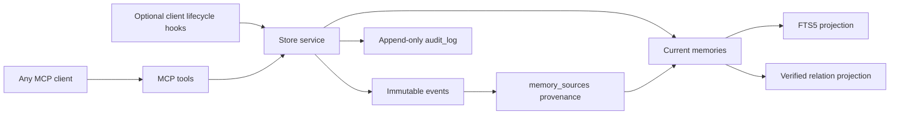

# Architecture

## Why Python and SQLite

Python 3.9+ is available on common developer machines and its standard library contains the HTTP, JSON, hashing, filesystem, and SQLite pieces this service needs. The runtime has no third-party dependencies. SQLite supplies atomic transactions, WAL concurrency, foreign keys, and FTS5 in one local file; this is a better MVP trade-off than adding a database daemon or embedding service.

The MCP adapter deliberately stays thin: newline-delimited JSON-RPC over stdio and Streamable HTTP-compatible JSON responses at `/mcp`. The business layer has no MCP dependency and can be exercised directly by tests or another client.

## Layers and invariants

- `events` preserve raw observations and provenance. Update/delete triggers make them append-only.
- `memories` are the current, explicitly statused interpretation. Their mutation history is retained in `audit_log`; sources are never replaced by a generated summary.
- `memory_sources` is the many-to-many evidence bridge. `edges` represents supersession, disputes, support, and dependencies.
- `memories_fts` is a rebuildable search projection. It is not truth.
- Every write opens `BEGIN IMMEDIATE`, updates all relevant layers, appends audit, stores an idempotent response when requested, and only then returns after `COMMIT`.

## Retrieval

FTS5 BM25 supplies lexical relevance. Ranking then favors importance and confidence. `get_context` excludes proposed and superseded entries by default, includes disputed entries as warnings, respects optional scope, and greedily selects complete blocks within a strict character budget. Each block cites source event IDs.

Project-owned search aliases expand known domain vocabulary before FTS matching. Aliases are explicit data, not inferred facts. `graph_traverse` walks verified memory edges with a depth limit of five and filters out non-current nodes by default. Both aliases and edges are exportable projections; neither replaces source events.

`EmbeddingProvider` is a small optional interface. A later local model or explicitly configured remote provider can implement it and add a vector score. Nothing downloads a model, sends content externally, or requires an API key in this MVP.

## Lifecycle

Memories normally move `proposed → active`. They can later become `superseded`, `disputed`, `expired`, or `rejected`. A superseding or disputing memory points to the affected memory through an edge. Transitions and snapshots are appended to the audit log.

## Threat model

The database directory is created mode `0700`. HTTP defaults to `127.0.0.1`; non-loopback binding is refused without a bearer token. Stdio is preferred because it creates no listening socket. These controls do not encrypt the database, redact secrets, isolate other processes running as the same OS user, or make bearer-token HTTP suitable for an untrusted network. Store only necessary project context and use OS disk encryption/backups.
